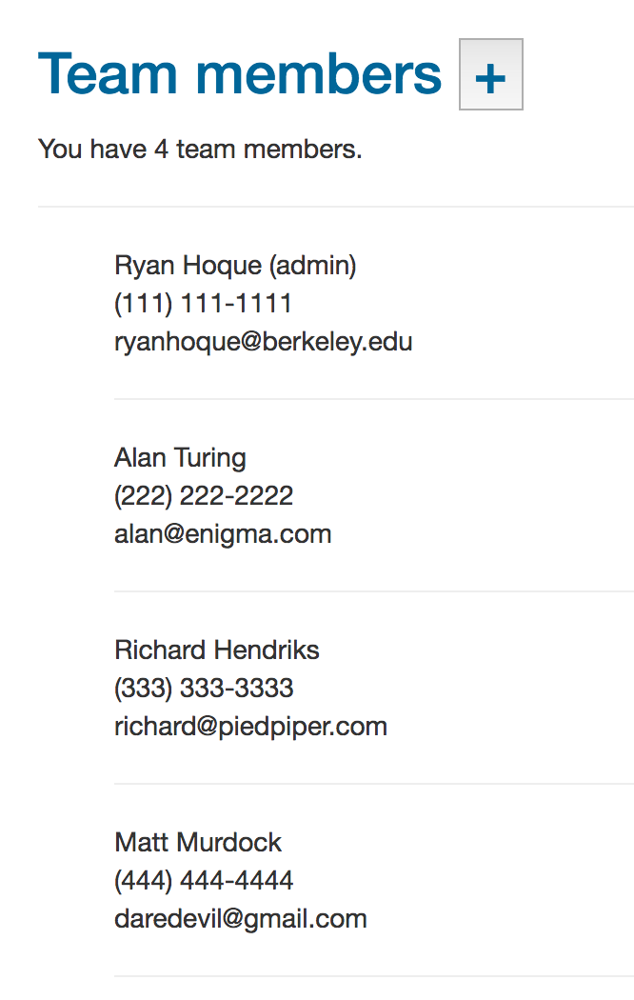
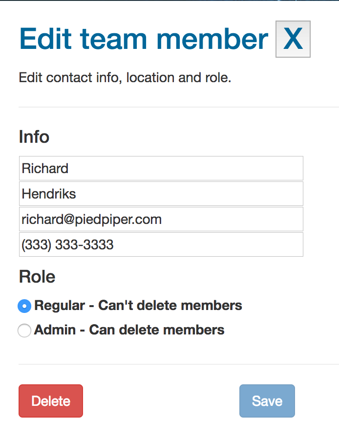
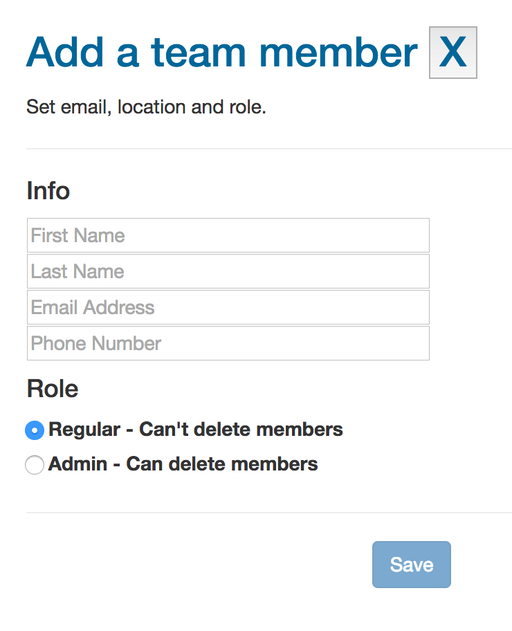

# How to run this project

Frontend for team member application made with React + Redux.

To launch, run 
```
> npm install
> webpack
> npm run start
```

Application will be on localhost port 3000.

Here are pictures of what it looks like:
## List View


## Edit View


## Add View

